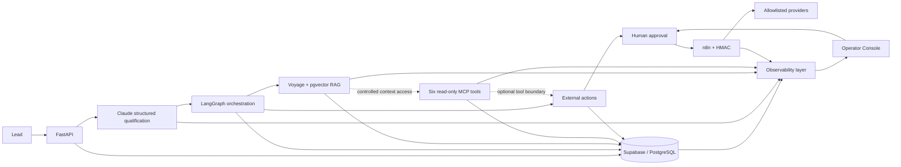
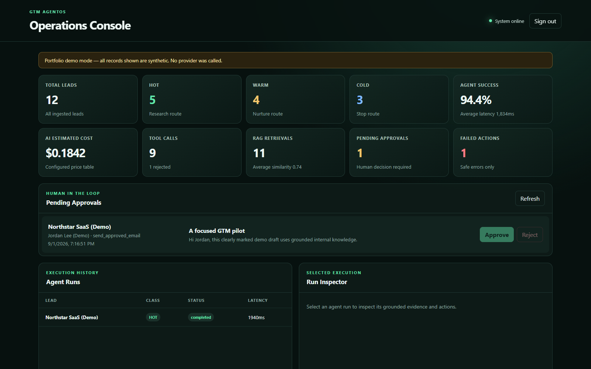
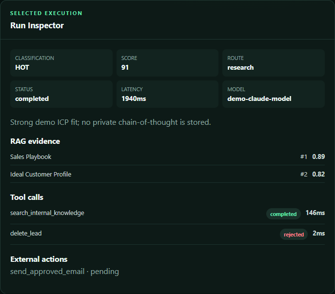
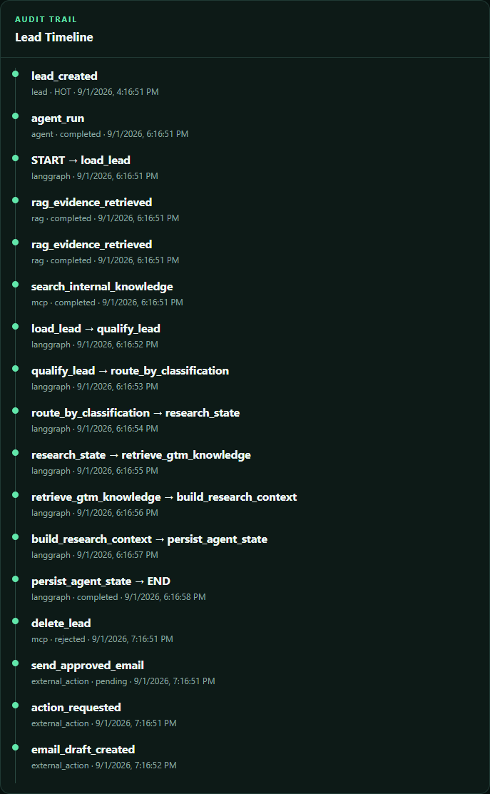
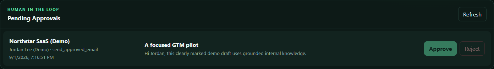

# GTM AgentOS

AI-native Revenue Operations platform that qualifies leads, orchestrates agent workflows, retrieves grounded GTM knowledge, exposes secure MCP tools, executes human-approved external actions, and provides production-style observability.

GTM AgentOS is a backend-first portfolio project built to demonstrate how an AI workflow can remain useful, deterministic, auditable, and safe across model calls, retrieval, tools, and external actions.

## What It Does

- Accepts and validates B2B leads through FastAPI.
- Uses Claude structured output to score each lead and classify it as `HOT`, `WARM`, or `COLD`.
- Runs a LangGraph workflow with deterministic application-owned routing.
- Grounds HOT-lead research in internal GTM documents using Voyage AI embeddings and PostgreSQL/pgvector.
- Exposes exactly six schema-validated, read-only MCP tools.
- Creates allowlisted external actions with human approval, HMAC-signed n8n dispatch, callbacks, and idempotency.
- Gives operators a protected console for metrics, run inspection, timelines, RAG evidence, approvals, latency, and AI usage.

## Why It Matters

Revenue workflows often combine inconsistent lead review, opaque model decisions, duplicated records, and risky automation. GTM AgentOS treats those concerns as engineering boundaries:

- model output is data, not control flow;
- retrieval is grounded in approved internal knowledge;
- every graph transition and tool call is auditable;
- external side effects require explicit policy and, where required, human approval;
- retries do not create duplicate leads, CRM records, or email sends;
- secrets remain server-side and sensitive fields are redacted from logs and audit payloads.

## Architecture



MCP is a controlled, read-only tool surface rather than a mandatory hop in every lead request. External actions are owned by the application workflow and cannot be created from arbitrary SQL, shell commands, URLs, or tool names.

## Highlights

- **FastAPI service:** strict request/response contracts and safe application errors.
- **Claude qualification:** native structured output mapped to Pydantic models.
- **LangGraph orchestration:** deterministic `HOT → research`, `WARM → nurture`, and `COLD → stop` routes.
- **Grounded RAG:** Voyage AI `voyage-4` embeddings, 1,024-dimensional vectors, cosine retrieval, Top-K filtering, and evidence persistence.
- **Six MCP tools:** allowlisted discovery, strict input/output schemas, safe projections, and append-only tool-call auditing.
- **Human-in-the-loop actions:** approval gates, closed action schemas, conditional state transitions, and safe callbacks.
- **n8n security:** HMAC SHA-256 signatures, replay-window checks, fixed provider destinations, and explicit rejection of disallowed actions.
- **Idempotency:** unique lead and action keys plus conditional updates prevent duplicate effects.
- **Audit trails:** model runs, graph transitions, RAG evidence, MCP calls, external-action events, callbacks, and AI usage.
- **Operator experience:** authenticated dashboard, run inspector, lead timeline, approval queue, failure visibility, latency, and cost estimates.
- **Regression coverage:** 118 automated tests across the six implemented phases.

## Demo / Screenshots

These are real captures of the Operations Console running locally in explicit Portfolio Mode. Every displayed record is synthetic and clearly labeled; no Supabase, Claude, Voyage, n8n, HubSpot, or Resend call was made while producing these images.

### Operations overview



### Run inspector



### Lead timeline



### Human approval queue



Additional focused captures are available for [RAG evidence](docs/images/rag-evidence.png), [MCP tool calls](docs/images/mcp-tool-calls.png), and [sanitized recent failures](docs/images/recent-failures.png).

## Major Technologies

| Area | Technology |
|---|---|
| API and validation | Python 3.12, FastAPI, Pydantic v2 |
| AI qualification and research | Anthropic Claude |
| Agent orchestration | LangGraph |
| Embeddings and retrieval | Voyage AI `voyage-4`, PostgreSQL, pgvector |
| Persistence | Supabase/PostgreSQL |
| Agent tools | Model Context Protocol Python SDK |
| External workflow execution | n8n |
| Provider adapters | HubSpot and Resend |
| Operations | Server-rendered console, protected admin API, structured logs |
| Testing | Pytest with in-memory fakes and local transports |

Direct dependencies are pinned in `requirements.txt`; the fully resolved Python 3.12 dependency graph is pinned in `requirements.lock`.

## Key Engineering Decisions

1. **Structured output before business logic.** Claude returns a bounded schema; Pydantic validates it before the application persists or routes anything.
2. **Application-owned routing.** The model cannot choose graph nodes, tool names, database objects, or external destinations.
3. **Repository and provider boundaries.** Supabase, Claude, Voyage, n8n, HubSpot, and Resend stay at the edges of the domain.
4. **Evidence before generation.** HOT-lead research uses only the validated lead and retrieved internal chunks. Empty retrieval skips the research model call.
5. **Closed tool and action registries.** Unknown MCP tools and disallowed action types fail before reaching a handler or provider.
6. **Approval before sensitive effects.** Email dispatch requires a persisted approval transition; draft creation alone cannot send.
7. **Append-only operational history.** Graph transitions, RAG retrievals, tool calls, external-action events, and AI usage provide traceability without exposing raw secrets.
8. **Least-privilege database access.** Migrations enable RLS, revoke public roles, and grant the backend only the operations required by each repository.
9. **Honest observability.** Token counts use provider-reported values; cost remains unknown unless both usage and an operator-maintained price are available.
10. **No chain-of-thought exposure.** The console shows concise public reasoning summaries and evidence, never hidden reasoning.

## Core Flow

The primary endpoint is:

```text
POST /api/v1/leads/agent
```

The request is validated, deduplicated, stored, qualified, routed, and audited:

```text
START
  ↓
load_lead
  ↓
qualify
  ↓
decision_router
  ├─ HOT  → research → retrieve_gtm_knowledge → build_research_context
  ├─ WARM → nurture
  └─ COLD → stop
  ↓
persist_agent_state
  ↓
END
```

The qualification-only endpoint remains available at `POST /api/v1/leads/qualify`.

### Example request

```bash
curl -X POST http://localhost:8000/api/v1/leads/agent \
  -H "Content-Type: application/json" \
  -d '{
    "external_id": "portfolio-demo-001",
    "name": "Alex Morgan",
    "email": "alex.morgan@example.com",
    "company": "Example Cloud",
    "job_title": "Head of Sales",
    "company_size": 80,
    "industry": "B2B SaaS",
    "country": "United States",
    "website": "https://example.com"
  }'
```

### Example response

```json
{
  "lead_id": "<lead-id>",
  "agent_run_id": "<agent-run-id>",
  "score": 90,
  "classification": "HOT",
  "route": "research",
  "next_action": "research_company",
  "status": "completed",
  "research_context": "Grounded summary from retrieved internal knowledge.",
  "sources": [
    {
      "document_id": "<document-id>",
      "chunk_id": "<chunk-id>",
      "title": "Ideal Customer Profile",
      "similarity": 0.91
    }
  ]
}
```

Identifiers above are illustrative placeholders, not records from a real environment.

## Grounded Knowledge Layer

The included `demo_knowledge/` files contain fictional ICP, product, sales-playbook, objection, and case-study material. The ingestion endpoint:

```text
POST /api/v1/knowledge/documents
```

creates a document, deterministic overlapping chunks, and one Voyage document embedding per chunk. Retrieval embeds the query with `input_type=query`, calls the service-role-only pgvector function, applies a bounded Top-K and similarity threshold, and persists the selected evidence in `rag_retrievals`.

If no chunk meets the threshold, the workflow returns:

```text
insufficient_internal_knowledge
```

Claude is not called to invent missing internal context.

## MCP Tool Surface

The isolated stdio MCP server exposes exactly six read-only tools:

| Tool | Purpose | Main boundary |
|---|---|---|
| `get_lead` | Safe lead projection | Omits email and website |
| `search_leads` | Bounded lead search | Approved filters; maximum 50 |
| `get_lead_history` | Run and transition history | Omits raw model payloads |
| `search_internal_knowledge` | Existing RAG retrieval | Query and Top-K bounds |
| `get_agent_run` | Safe run inspection | Allowlisted output keys |
| `get_pipeline_summary` | Fixed pipeline aggregates | No custom SQL or grouping |

The registry rejects unknown tools, extra fields, arbitrary SQL, shell commands, file paths, environment-variable names, and arbitrary URLs. Accepted, rejected, and failed attempts are recorded in `tool_calls` with sanitized payloads and latency.

Start the MCP server with:

```bash
python -m app.mcp.server
```

## External Actions and n8n

The backend supports only these action types:

- `create_or_update_crm_lead`
- `create_follow_up_task`
- `draft_outreach_email`
- `send_approved_email`
- `mark_lead_status`

There is no generic execution endpoint and no destructive `delete_lead` action. Sensitive actions pass through a persisted lifecycle:

```text
pending → approved → executing → completed | failed
        ↘ rejected
```

Every action has a stable idempotency key. Approval and callback updates are conditional, and external lifecycle events are append-only. The exported workflow at `n8n/gtm-agentos-actions.workflow.json` contains 16 nodes, no embedded credentials, explicit action allowlisting, HubSpot and Resend HTTP adapters, placeholders for non-provider actions, signed callbacks, and a controlled HTTP 400 rejection path.

Runtime credentials and destinations are supplied to n8n through environment variables:

```dotenv
N8N_WEBHOOK_SECRET=replace-with-a-long-random-shared-secret
GTM_AGENTOS_CALLBACK_URL=https://backend.example.com/api/v1/integrations/n8n/callback
HUBSPOT_ACCESS_TOKEN=your-hubspot-private-app-token
RESEND_API_KEY=your-resend-api-key
RESEND_FROM_EMAIL=GTM AgentOS <sender@your-verified-domain.example>
EMAIL_TEST_RECIPIENT=allowed-recipient@example.com
NODE_FUNCTION_ALLOW_BUILTIN=crypto,url
```

Do not commit those values. Provider calls should use test records and an allowlisted recipient during controlled validation.

## Observability and Human Operations

The protected Operations Console is available at:

```text
http://localhost:8000/operator
```

It includes:

- lead classification and score;
- agent success, failures, route, latency, and transition timeline;
- ranked RAG evidence and similarity;
- MCP status and rejected-call visibility;
- external-action state and approval queue;
- safe failure codes;
- provider-reported token usage and optional cost estimates.

The operator key is exchanged server-side for a signed, bounded, `HttpOnly`, `SameSite=Strict` session cookie. The browser bundle never receives the key. API clients may use `X-Operator-Key`; n8n callbacks remain independently protected by timestamped HMAC signatures.

Protected administrative endpoints:

```text
GET /api/v1/admin/overview
GET /api/v1/admin/agent-runs
GET /api/v1/admin/agent-runs/{run_id}
GET /api/v1/admin/actions
GET /api/v1/admin/leads/{lead_id}/timeline
GET /api/v1/admin/usage
```

Public health probes:

```text
GET /health
GET /ready
```

`/ready` performs a bounded database read. It does not call Claude, Voyage, n8n, HubSpot, or Resend.

## End-to-End Validation

The project was exercised through controlled real integrations in addition to its isolated test suite:

- **Supabase/PostgreSQL:** migrations, persistence, RLS/grants, lead/run records, graph transitions, vector retrieval, action events, tool calls, and observability queries.
- **Anthropic Claude:** real structured lead qualification and grounded research generation.
- **LangGraph:** real `START`-to-`END` execution with deterministic classification routes.
- **Voyage AI + pgvector:** real `voyage-4` document/query embeddings, 1,024 dimensions, relevant Top-K retrieval, evidence persistence, and the no-context fallback.
- **MCP:** real SDK discovery of exactly six tools, successful reads, invalid-payload rejection, unknown-tool rejection, and audit verification.
- **n8n:** the permanent remote workflow was updated and activated through its API; signed webhook acceptance and explicit disallowed-action rejection were verified.
- **HubSpot adapter:** one controlled existing-contact flow completed through n8n without creating a duplicate.
- **Resend adapter:** one approval-gated email was sent to the configured allowlisted test recipient; callback persistence and idempotency were verified without a second provider send.
- **Operations Console:** a real Supabase-backed lead, run, timeline, RAG evidence, latency, and updated metrics were inspected locally.

These were bounded end-to-end validation runs. They demonstrate integration behavior; they are not a claim that this repository is operating as an unattended production service.

No live record IDs, workflow IDs, account identifiers, recipients, tokens, or credentials are published here.

## Engineering Challenges

### Structured output validation

Model output is validated at the provider boundary and again before it can affect persistence or routing. Invalid classifications, scores, actions, and extra fields fail closed.

### Cross-layer idempotency

Lead ingestion, external-action creation, approval, dispatch, callback handling, CRM upsert, and email behavior each need a stable identity and conditional transitions. Database uniqueness remains the final concurrency boundary.

### Auditing a graph without exposing internals

Every state transition is persisted from `START` to `END`, while stored and displayed payloads remain bounded. Operators see evidence and public summaries, not chain-of-thought.

### Grounded retrieval and the no-context case

Document and query embeddings use the appropriate Voyage input types. pgvector evidence is ranked and persisted. When internal knowledge is insufficient, the application returns an explicit fallback instead of calling Claude for speculation.

### MCP allowlisting

Tool discovery, schemas, execution, output validation, redaction, and auditing share one closed registry. This prevents a generic tool layer from becoming arbitrary database or system access.

### Approval gates and external effects

Draft generation is separate from execution. Approval is a persisted state transition, and rejection is terminal. The provider never receives a request merely because a model produced a draft.

### HMAC, replay protection, and action idempotency

n8n requests and callbacks sign `timestamp.raw_body`, use constant-time comparison, and reject stale timestamps. Stable action keys and conditional updates prevent repeated approval or callback delivery from duplicating side effects.

### Secure operator sessions

The operator secret stays server-side. Login uses constant-time comparison and exchanges the key for a signed session cookie with bounded age and strict browser attributes.

## Database and Security

Apply migrations in order:

```text
sql/001_initial_schema.sql
sql/002_agent_state_transitions.sql
sql/003_rag_knowledge_base.sql
sql/004_mcp_tool_calls.sql
sql/005_external_actions.sql
sql/006_observability.sql
```

The schema includes `leads`, `agent_runs`, `agent_state_transitions`, knowledge documents/chunks, `rag_retrievals`, `tool_calls`, external actions/events, AI usage events, indexes, constraints, vector search, and aggregate observability views.

RLS is enabled on application tables. Public roles are revoked where the backend owns access, and append-only tables do not receive update/delete grants. Supabase recommends RLS and careful API-key handling as core Data API controls; see [Securing your data](https://supabase.com/docs/guides/database/secure-data) and [API keys](https://supabase.com/docs/guides/getting-started/api-keys).

`SUPABASE_KEY` must be a backend-only secret/service-role key. Never expose it in a browser, client bundle, MCP argument, log, screenshot, or Git commit.

## Running Locally

Requirements:

- Python 3.12
- a Supabase project with the six migrations applied
- Anthropic and Voyage credentials for real AI/RAG mode
- optional n8n/provider credentials only for separately authorized external-action tests

1. Create and activate a virtual environment.

   Windows PowerShell:

   ```powershell
   py -3.12 -m venv .venv
   .\.venv\Scripts\Activate.ps1
   ```

   macOS/Linux:

   ```bash
   python3.12 -m venv .venv
   source .venv/bin/activate
   ```

2. Install the locked dependencies.

   ```bash
   python -m pip install -r requirements.lock
   ```

3. Copy `.env.example` to `.env`, replace every placeholder, and keep the file local.

4. Start the API.

   ```bash
   uvicorn app.main:app --reload
   ```

5. Verify the process and database.

   ```bash
   curl http://localhost:8000/health
   curl http://localhost:8000/ready
   ```

6. Open `http://localhost:8000/operator` and authenticate with the locally configured operator key.

### Portfolio mode

`PORTFOLIO_MODE=true` uses a clearly labeled, in-memory synthetic observability read model. It makes no Supabase, Claude, Voyage, HubSpot, Resend, or n8n call, and approval controls are disabled for synthetic actions.

Use real mode for integration validation:

```dotenv
PORTFOLIO_MODE=false
```

## Testing

Run:

```bash
pytest
```

The suite contains 118 tests. It replaces Supabase, Claude, Voyage, vector search, n8n, HubSpot, Resend, and MCP persistence with in-memory fakes or local transports, so regression runs require no paid calls or secrets.

Coverage includes:

- qualification, validation, deduplication, safe provider failures, and run auditing;
- all LangGraph routes, transitions, response contracts, and graph failures;
- ingestion, embeddings, retrieval, HOT-only RAG, evidence, and no-context behavior;
- six MCP tools, SDK discovery, schema enforcement, redaction, limits, and audit statuses;
- approval, rejection, dispatch, callbacks, HMAC, replay protection, and idempotency;
- operator authentication, sessions, protected APIs, metrics, timelines, RAG evidence, usage, readiness, and browser-asset secret checks.

## Repository Layout

```text
app/
├── agents/          # LangGraph state and routing
├── api/             # FastAPI routes and dependency composition
├── core/            # Configuration, auth, pricing, errors, logging
├── integrations/    # n8n, HubSpot, and Resend boundaries
├── mcp/             # stdio server, registry, schemas, tools, auditing
├── models/          # persistence records
├── repositories/    # Supabase and in-memory data access
├── schemas/         # strict API and domain contracts
├── services/        # qualification, RAG, orchestration, actions, observability
└── static/          # Operations Console assets
demo_knowledge/      # fictional internal GTM documents
n8n/                # credential-free workflow export
sql/                # incremental migrations
tests/               # 118-test regression suite
docs/images/        # reserved sanitized public screenshots
```

## Project Status

Phases 1–6 are implemented and validated. The repository is production-oriented and portfolio-ready in architecture, safety boundaries, tests, and documentation; operating it in production would still require environment-specific deployment, monitoring, secret management, data-retention, and incident-response decisions.

## License

This project is available under the [MIT License](LICENSE).
